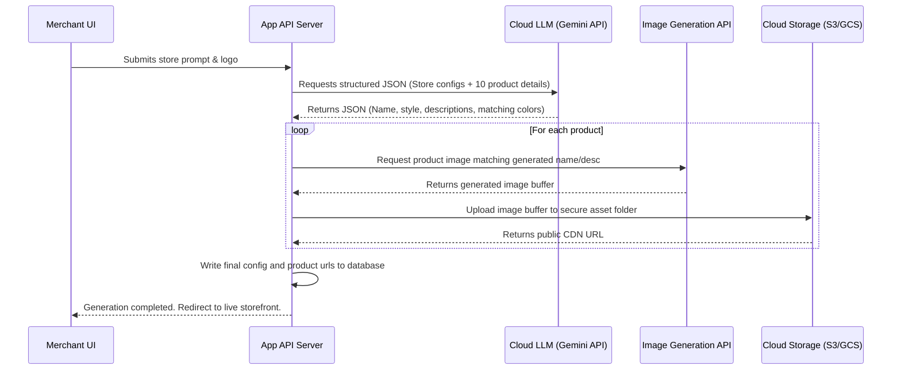

# 🏪 Dukaan AI — Prompt-Driven E-Commerce Generator

> [!IMPORTANT]
> **Project Status: Under Active Development** 🛠️  
> This project is currently in the prototyping phase. Features, prompt parsing models, and AI integrations are actively being developed, refactored, and optimized.

Dukaan AI is an intelligent, prompt-driven e-commerce store generator. By entering a simple description of your desired store (e.g., *"Create a luxury sneaker store with a dark black and red theme"*), Dukaan AI parses the requirement and compiles a fully customized storefront, an admin ERP dashboard, an interactive mobile app simulator, and an AI-powered shopping assistant.

---

## 🚀 Quick Start Guide

To run the project locally, ensure you have the prerequisites installed, then follow the setup steps below.

### Prerequisites
* **Node.js** (v18 or higher recommended)
* **Ollama** (Required for chatbot and design AI customization)

### Step 1: Start the Local AI Instance (Ollama)
Dukaan AI relies on a local instance of Ollama to generate store tags, taglines, product catalogues, and to power the live design modifications.

1. Open your terminal and run the default model (e.g. `llama3.2`):
   ```bash
   ollama run llama3.2
   ```
2. Keep this terminal open so the local Ollama API (`http://localhost:11434`) remains accessible.

### Step 2: Install & Start the Frontend
1. Open another terminal and navigate to the project directory:
   ```bash
   cd ecommerce-generator
   ```
2. Install dependencies:
   ```bash
   npm install
   ```
3. Start the Vite development server:
   ```bash
   npm run dev
   ```
4. Open your browser to the local link (usually `http://localhost:5173`).

---

## ✨ Detailed Feature Audit

Dukaan AI is composed of several modules working together to build and simulate the e-commerce experience:

### 1. Onboarding & Prompt Parsing Flow
* **Natural Language Parsing ([promptParser.js](file:///c:/Users/godre/Downloads/Project124/ecommerce-generator/src/utils/promptParser.js))**:
  Processes free-form prompts to extract:
  * **Store Name**: Detected from quotes or keywords preceding standard store markers.
  * **Brand Colors**: Maps 25+ colors to hex codes.
  * **Dark Mode**: Automatically toggled based on terms like `dark`, `night`, or `black`.
  * **Theme & Layout**: Resolves layout styling (Grid vs. Spacious) and theme options (Minimal, Luxury, Bold, Modern).
* **Multi-Step Wizard ([OnboardingFlow.jsx](file:///c:/Users/godre/Downloads/Project124/ecommerce-generator/src/pages/OnboardingFlow.jsx))**:
  Guides users through store customization steps, including uploading a logo URL (which automatically extracts a primary color match using canvas image extraction) and selecting visual styles.
* **Ollama Integration ([ollamaService.js](file:///c:/Users/godre/Downloads/Project124/ecommerce-generator/src/utils/ollamaService.js))**:
  Queries local LLMs to generate tags, taglines, customized product names, and design mood descriptors.

### 2. Design System & Dynamic Variants
* **Token Spacing System ([themeGenerator.js](file:///c:/Users/godre/Downloads/Project124/ecommerce-generator/src/utils/themeGenerator.js))**:
  Translates theme selections into custom styling tokens for margins, padding, card radiuses, and shadows.
* **10 Design Variants ([variantSystem.js](file:///c:/Users/godre/Downloads/Project124/ecommerce-generator/src/utils/variantSystem.js))**:
  Determines storefront look-and-feel based on assigned layout indices (0–9):
  * `Classic Premium`: Standard centered layout, elevated product cards.
  * `Editorial Magazine`: Large typography, vertical cards, sidebar navigation, reveal animations.
  * `Tech Precision`: Dark high-contrast styling, split heroes, bordered cards.
  * `Bold Impact`: Fullscreen background overlays, thick offset card styling.
  * `Soft Organic`: Pastel colors, high rounded card borders, bounce animations.
  * `Glass Morphism`: Diagonal layouts, colored background blobs, and frosted glass cards.
  * `Neo Brutalist`: Solid shadows, blocky structures, no transitions.
  * `Warm Editorial`: Clean layouts, line badges, and reveal effects.
  * `Premium Noir`: Dark theme, uppercase spacing, minimal borderless grids.

### 3. Storefront Pages & Checkouts
* **StoreFront ([StoreFront.jsx](file:///c:/Users/godre/Downloads/Project124/ecommerce-generator/src/pages/StoreFront.jsx))**: Renders dynamic hero grids, category collection lists, trust badges, and catalog sections matching the merchant's theme.
* **Browse & Filters ([BrowsePage.jsx](file:///c:/Users/godre/Downloads/Project124/ecommerce-generator/src/pages/BrowsePage.jsx))**: Integrates full-text search, rating check boxes, sort options, and maximum price boundaries.
* **Cart & Checkout ([CartPage.jsx](file:///c:/Users/godre/Downloads/Project124/ecommerce-generator/src/pages/CartPage.jsx) / [CheckoutPage.jsx](file:///c:/Users/godre/Downloads/Project124/ecommerce-generator/src/pages/CheckoutPage.jsx))**: Full-cart management controls coupled with simulated billing forms, processing sequences, and order receipts.

### 4. Admin Dashboard (ERP)
* **ERP Portal ([DashboardPage.jsx](file:///c:/Users/godre/Downloads/Project124/ecommerce-generator/src/pages/DashboardPage.jsx))**: Includes live analytics charts (monthly earnings line charts and weekly orders bar charts via Chart.js), catalogs list with stock checkmarks, sales order databases, manual product insertions, and banner styling options.

### 5. Mobile Simulator
* **Web & Native Previews ([MobileAppPage.jsx](file:///c:/Users/godre/Downloads/Project124/ecommerce-generator/src/pages/MobileAppPage.jsx))**: 
  Generates functional Expo React Native template code. Features a live web iframe simulator of the store, and creates QR codes to view the simulator directly on a smartphone or open the native code template inside the Expo Go app.

### 6. AI Shopping & Design Chatbot
* **Interactive Bot ([Chatbot.jsx](file:///c:/Users/godre/Downloads/Project124/ecommerce-generator/src/components/Chatbot.jsx))**: 
  A dual-mode sidebar assistant:
  * *Shopping Tab*: Queries the product index to recommend items, handles adding items to the cart via natural language, and takes users directly to checkout.
  * *Make Changes Tab*: Submits styling request prompts to Ollama to return structured JSON configuration updates, instantly applying them to the live site.

---

## 🛠️ Areas for Improvement (Development Roadmap)

To transition Dukaan AI from an interactive prototype to a production-ready SaaS product, several key improvements are planned:

1. **Cloud AI Services**: Replace local Ollama dependencies with managed cloud API routes (e.g. Gemini API, OpenAI API) so deployed instances can run the chatbot without requiring a local server.
2. **LLM-First Configuration**: Let the LLM generate the full design JSON configuration from the prompt during onboarding, replacing the regex keyword search.
3. **Consistent Product Images**: Integrate image generation pipelines (e.g., Stable Diffusion or Imagen) to generate matching product assets instead of using static placeholder search tags.
4. **State Persistence**: Transition state management from browser `localStorage` to a hosted database (e.g. PostgreSQL, Supabase).

---

## 🏗️ Production System Architecture

When scaled, Dukaan AI's architecture will utilize microservices to ensure scale:

```
[ Customer Web Browser ]     [ Merchant Dashboard ]
          │                           │
          ▼                           ▼
┌──────────────────────────────────────────────┐
│             API Gateway & Router             │
└──────────────────────┬───────────────────────┘
                       │
         ┌─────────────┴─────────────┐
         ▼                           ▼
┌─────────────────┐         ┌─────────────────┐
│  Storefront     │         │  Admin & ERP    │
│  Render Service │         │  Microservice   │
└────────┬────────┘         └────────┬────────┘
         │                           │
         └─────────────┬─────────────┘
                       ▼
┌──────────────────────────────────────────────┐
│          Core Application Services           │
│  (Auth, Orders, Products, Cart Management)   │
└──────────────────────┬───────────────────────┘
                       ├───────────────────────┐
                       ▼                       ▼
             ┌───────────────────┐   ┌───────────────────┐
             │ AI Generation Engine │   │ Payment Processor │
             │ (Gemini/Stripe APIs)  │   │  (Stripe Gateway) │
             └─────────┬─────────┘   └───────────────────┘
                       ▼
             ┌───────────────────┐
             │   Asset Bucket    │
             │  (GCS / AWS S3)   │
             └───────────────────┘
```

### AI Generation & Upload Workflow



---

## 📅 Phased Execution Plan

```carousel
### Phase 1: Core SaaS Foundation
* Migrate local Ollama queries to cloud LLM routes.
* Implement merchant JWT login sessions.
* Connect database schemas to replace client-side `localStorage`.
<!-- slide -->
### Phase 2: Payments & Rich Assets
* Integrate dynamic product photography generation.
* Connect Stripe Connect elements on checkouts.
* Build a visual builder panel for manual layout edits.
<!-- slide -->
### Phase 3: Domain Mapping & EAS Compilation
* Implement wildcard subdomain registrations (`<slug>.dukaanai.com`).
* Configure Next.js static site generator builds on CDN edges.
* Enable background workers to run EAS CLI builds for compiling mobile app installer files.
```

---

## 📂 Project File Structure
```text
ecommerce-generator/
├── src/
│   ├── components/      # UI elements (Navbar, Product Cards, Cart, Chatbot)
│   ├── context/         # AppContext.jsx managing global state (cart, products, orders)
│   ├── hooks/           # useTheme, useVariant, useScrollReveal hooks
│   ├── pages/           # StoreFront, Browse, Details, Checkout, Dashboard, MobileApp
│   ├── utils/           # Mock data generators, prompt parsing, Ollama API wrappers
│   ├── App.jsx          # Main page switcher and router layout
│   └── main.jsx         # App entry point
├── index.html           # HTML wrapper template
└── package.json         # NPM package dependencies (React 19, Vite 8, Chart.js)
```

---

## 🛠️ Tech Stack
* **Frontend Framework**: React (v19)
* **Build Engine**: Vite (v8)
* **Visualizations**: Chart.js & React-ChartJS-2
* **Styling Sheets**: Raw CSS design tokens
* **AI Model Engine**: Ollama (Llama 3.2 local server)# Dukaan_AI

