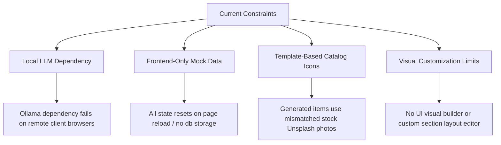
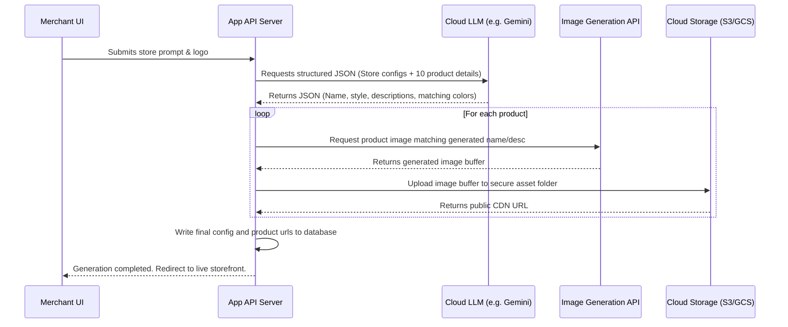

# StoreGen: Feature Analysis & Production Roadmap

This document provides a comprehensive analysis of the **StoreGen** website generator application. It outlines the existing features in detail, reviews areas for immediate improvement, and presents a structured architectural roadmap for scaling and deploying StoreGen as a production-grade SaaS product for merchants.

---

## Part 1: Comprehensive Feature Audit

StoreGen is an AI-powered e-commerce builder that takes a natural language prompt and compiles it into a custom-styled, interactive web store with a corresponding simulated mobile app. Below is an audit of every major module and its sub-features.

### 1. Onboarding & Design Engine
* **Natural Language Prompt Parser (`promptParser.js`)**: 
  A rules-based parsing engine that scans the user's free-form text description for key triggers:
  * **Store Name Detection**: Extracts name suggestions from quotes (`"Apex Shoes"`) or locates nouns preceding store keywords (e.g. `shop`, `boutique`, `market`).
  * **Color Mapping**: Scans for 25+ color name keywords (e.g., `emerald`, `indigo`, `rose`, `amber`) and maps them to clean hex tokens.
  * **Dark Mode Toggling**: Flags the presence of words like `dark`, `night`, `black`, `shadow` to enable dark interfaces.
  * **Category Resolution**: Maps product keywords to 8 domains: *Fashion, Sneakers, Tech, Jewelry, Sports, Beauty, Books, Home*.
  * **Design Style Alignment**: Resolves keywords to theme styles: *Minimal, Luxury, Bold, Modern, Vintage*.
  * **Layout & Tone Selection**: Infers layout spacing (*Grid* vs *Spacious*) and brand voice (*Modern, Playful, Premium*).
  * **Design Variant Mapping**: Matches prompts directly to one of 10 pre-defined variant IDs if specific styles (e.g., `glassmorphism`, `brutalist`, `neon`) are requested.
* **Onboarding Flow Wizard (`OnboardingFlow.jsx`)**:
  An interactive 7-step wizard interface:
  * *Step 1: Prompt Input*: The launchpad, featuring quick-start template chips (e.g. "Luxury sneaker store, dark theme") and an Ollama connection controller.
  * *Step 2: Brand Logo*: URL input with an optional average color extractor.
  * *Step 3: Name Confirmation*: Allows manual correction of parsed names.
  * *Step 4: Category Picker*: Visual cards representing the 8 supported catalog templates.
  * *Step 5: Style Picker*: Allows choosing between different design architectures (Minimal, Luxury, Bold, Modern).
  * *Step 6: Spacing & Layout*: Configures the product density layout.
  * *Step 7: Tone & Generation*: Summarizes options before launching the generation engine.
* **Ollama Integration (`ollamaService.js`)**:
  If a local Ollama instance is detected, the builder uses it to generate:
  * A custom single-sentence premium store tagline (max 10 words).
  * 6 unique product titles matching the theme and category.
  * A concise 5-word design mood descriptor (e.g., "clean geometric precision").
  * A primary hex color aligned with the style description.
  * Falls back dynamically to templates if Ollama is unavailable.

### 2. Live Design System & Variants
* **Dynamic Design Tokens (`themeGenerator.js`)**:
  Converts selected styles into a runtime token set:
  | Style | Border Radius | Card Padding | Spacing | Heading Weight | Spacing |
  | :--- | :--- | :--- | :--- | :--- | :--- |
  | **Minimal** | 4px | 1.25rem | 5rem | 600 (Semibold) | 0.01em |
  | **Luxury** | 2px | 2.00rem | 8rem | 300 (Light) | 0.04em |
  | **Bold** | 8px | 1.50rem | 5rem | 800 (Extra Bold)| 0.00em |
  | **Modern** | 8px | 1.50rem | 6rem | 700 (Bold) | 0.01em |
  | **Vintage** | 0px (Sharp) | 1.50rem | 5rem | 700 (Bold) | 0.03em |
* **Average Color Extraction**:
  Uses an offscreen HTML5 `<canvas>` rendering to sample image pixel data from an uploaded logo URL, dynamically resolving a primary color hex code to style the accent elements.
* **10 Deterministic Design Variants (`variantSystem.js`)**:
  Each variant acts as a cohesive visual sub-theme:
  * `0 - Classic Premium`: Centered hero, elevated cards, solid nav, grid layout.
  * `1 - Editorial Magazine`: Magazine hero, side-positioned navigation, magazine-layout cards, vertical ratios, borderless design, slide reveal animations.
  * `2 - Tech Precision`: Split hero, dark tinted background, compact grid, bordered cards, slide animations.
  * `3 - Bold Impact`: Fullscreen hero, thick offset card borders, glass nav, uppercase header tags, scale animations.
  * `4 - Soft Organic`: Stacked hero, background gradients, rounded glass cards (20px radius), bounce animations.
  * `5 - Dark Neon`: Centered hero, dark bg, borderless cards, neon glows, scroll reveal.
  * `6 - Glass Morphism`: Diagonal hero, floating colored backdrop blur circles, frosted glass cards.
  * `7 - Neo Brutalist`: Stacked hero, raw thick borders, solid offset shadows, side nav, minimal animations.
  * `8 - Warm Editorial`: Split hero, soft warm tints, minimal layout, line badges, text-focus animations.
  * `9 - Premium Noir`: Fullscreen hero, dark theme, wide uppercase spacing, borderless minimal design.

### 3. Storefront Pages & Shopping Flow
* **Category Hero Section (`StoreFront.jsx`)**:
  Fuses the generated store metadata, tagline, and category into one of 6 structural layouts (split, magazine, fullscreen, diagonal, stacked, centered) using custom Unsplash imagery.
* **Browse & Filtering System (`BrowsePage.jsx`)**:
  A shopping search and filtering page including:
  * Full-text matching across the product index.
  * Category quick-filter pills.
  * Price range filter slider bound to catalog pricing.
  * Star rating filter groups (Any, 3.5+, 4.0+, 4.5+).
  * 5 sorting algorithms (Default, Price Asc/Desc, Rating, Alphabetical).
* **Product Details View (`ProductDetailsPage.jsx`)**:
  Includes breadcrumbs, interactive main image zoom frame, detailed pricing, description, a relative products recommendation grid ("You might also like"), and dynamic Add to Cart/Wishlist actions.
* **Wishlist Portal (`WishlistPage.jsx`)**:
  Renders a saved-items folder, with single-click remove or Add to Cart actions directly from cards.
* **Cart State Management (`CartPage.jsx` / `CartItem.jsx`)**:
  Responsive cart drawer containing thumbnail badges, pricing calculators, and subtotal increments.

### 4. Interactive Simulation & Admin Controls
* **Simulated Checkout (`CheckoutPage.jsx`)**:
  Guides customers through mock Shipping forms (Name, Email, Address, Zip) and Billing forms (Card Number, Expiry, CVV). Renders a realistic "Processing Payment..." loading screen followed by an Order Confirmation page displaying a generated `ORD-` ID.
* **ERP Admin Dashboard (`DashboardPage.jsx`)**:
  A administration center with 5 tabs:
  * *Overview*: Renders KPI metrics (Revenue, Orders, Products, AOV) and Chart.js animations tracking monthly revenue and daily order frequencies alongside recent orders.
  * *Products Catalog*: Interactive database view allowing merchants to inspect stock levels, ratings, prices, and delete items.
  * *Orders Ledger*: Logs all customer transactions, showing statuses (Delivered, Shipped, Processing, Cancelled).
  * *Add Product*: Let's admins upload custom products (Name, Price, Category, Image URL) directly into the running catalog.
  * *Settings*: Simple configuration settings for updating the Logo URL and Cover Image.
* **Mobile App Simulator (`MobileAppPage.jsx`)**:
  Displays a fully interactive phone frame running the storefront in simulator dimensions (`?simulator=1` query parameter). Generates functional React Native (Expo) code displaying lists, detail pages, and checkout, alongside setup guides and Expo Go QR codes.

### 5. Multi-Mode AI Chatbot (`Chatbot.jsx`)
* **Shopping Mode Tab**:
  Acts as an automated salesperson. Customers can query products, request recommendations, or type commands (e.g. "add Air Classic to cart" or "checkout"), which are intercepted by regex filters to execute frontend state functions instantly. Calls local Ollama models for custom text replies.
* **Design Editor Mode Tab ("Make Changes")**:
  Interprets styling instructions (e.g., "make the store minimal with dark green background"). Calls Ollama to construct a structured JSON object detailing theme parameters (`primaryColor`, `isDark`, `designStyle`, `layoutStyle`, `brandTone`), which is parsed and applied dynamically to the running storefront.

---

## Part 2: Critical Areas for Improvement

While the prototype contains impressive interactive modules, several engineering gaps exist that limit production deployment:



### 1. LLM Infrastructure
* **The Problem**: Relying on a local Ollama instance (`http://localhost:11434`) means that when deployed, remote visitors cannot use the chatbot or design generator unless they run a local daemon.
* **The Fix**: Transition to a cloud-hosted LLM API provider. Implement a server-side route that proxies requests using a secure, managed API key.

### 2. Prompt Processing & Color Parsing
* **The Problem**: Keyword-based regex parsing for color codes and categories is highly fragile. Prompts like "a sunset colored boutique" fail to select suitable warm colors because "sunset" isn't a hardcoded color key.
* **The Fix**: Let the LLM parse the user's prompt *first* in a single structured JSON response (using JSON mode or function calling). This allows a much wider, more creative mapping of styles and colors.

### 3. Product Catalog Consistency
* **The Problem**: Ollama generates product titles, but the images are loaded from generic, pre-defined Unsplash search terms based on the category. A generated item named "Drone Vista 4K" might display a picture of headphones.
* **The Fix**: Integrate an image generation pipeline (like Stable Diffusion or Imagen) to create custom product photography matching the generated product titles.

### 4. Database & State Persistence
* **The Problem**: All configuration, cart contents, product listings, and order details reside in the browser's `localStorage`. This resets when clearing storage, and makes sharing links or managing real inventory impossible.
* **The Fix**: Replace mock utilities with a relational database (PostgreSQL) and a server-side storage system.

---

## Part 3: Deployable & Scalable Production Roadmap

To transition StoreGen from a frontend builder prototype into a commercially viable SaaS product (an AI-driven shop-builder similar to Shopify + Vercel), the following system architecture must be implemented.

### Phase 1: High-Level System Architecture
The production system should be divided into specialized microservices to ensure horizontal scaling:

```
[ Customer Web Browser ]     [ Merchant Dashboard ]
          │                           │
          ▼                           ▼
┌──────────────────────────────────────────────┐
│             API Gateway & Router             │
└──────────────────────┬───────────────────────┘
                       │
         ┌─────────────┴─────────────┐
         ▼                           ▼
┌─────────────────┐         ┌─────────────────┐
│  Storefront     │         │  Admin & ERP    │
│  Render Service │         │  Microservice   │
└────────┬────────┘         └────────┬────────┘
         │                           │
         └─────────────┬─────────────┘
                       ▼
┌──────────────────────────────────────────────┐
│          Core Application Services           │
│  (Auth, Orders, Products, Cart Management)   │
└──────────────────────┬───────────────────────┘
                       ├───────────────────────┐
                       ▼                       ▼
             ┌───────────────────┐   ┌───────────────────┐
             │ AI Generation Engine │   │ Payment Processor │
             │ (Gemini/Stripe APIs)  │   │  (Stripe Gateway) │
             └─────────┬─────────┘   └───────────────────┘
                       ▼
             ┌───────────────────┐
             │   Asset Bucket    │
             │  (GCS / AWS S3)   │
             └───────────────────┘
```

#### 1. Core Services & Database
* **Database (PostgreSQL)**: To hold relational tables for `users` (merchants), `stores` (subdomain configurations), `products` (details, inventory, dimensions), and `orders`.
* **API Server (Express / NestJS / Go)**: Houses business logic for cart processing, order calculation, user authentication, and inventory syncs.

#### 2. The AI Store Generation Pipeline
Instead of local parsing, the system should follow this pipeline:



#### 3. Real Payment & Fulfillment Integration
* **Stripe Connect**: Integrates merchant accounts. When a customer checks out, payment is processed securely, and funds are distributed to the merchant's account automatically.
* **Inventory Control & Locking**: Implements database-level transaction locks during checkouts to prevent overselling of hot items.
* **Shipping Integrations (Shippo / ShipStation)**: Fetches real-time shipping costs based on package dimensions and customer addresses, and issues tracking links automatically.

#### 4. Serverless Storefront Hosting (Vercel-style deployment)
* **Static Site Generation (SSG)**: Convert the storefront layout into a Next.js or Astro template. When a store configuration is updated, trigger a rebuild or use Incremental Static Regeneration (ISR) to compile optimized HTML pages.
* **Custom Domain Mapping**: Configure reverse proxy routers (e.g., Caddy, Nginx, or Vercel Domains API) to route custom domains (e.g. `www.my-store.com`) or subdomains (`my-store.storegen.com`) directly to the matching tenant configuration in the database.

#### 5. Mobile Native Compiler
* **Expo EAS Build Microservice**:
  1. Take the dynamically generated React Native code.
  2. Write it into a modular Expo template project on the server.
  3. Invoke Expo Application Services (EAS) CLI commands via a worker queue to compile iOS (`.ipa`) and Android (`.apk` / `.aab`) binaries.
  4. Provide download links in the merchant's dashboard, ready for App Store submission.

---

## Part 4: Phased Execution Plan

To execute this transition efficiently, we recommend a 3-step development plan:

```carousel
### Phase 1: Cloud Integration & DB Migration
* **API Modernization**: Replace local Ollama calls with server-side proxy routes to cloud LLM models.
* **Authentication**: Introduce JWT-based user login schemas for merchants and customers.
* **Database Hookup**: Swap out `localStorage` hooks in `AppContext.jsx` for REST API requests syncing with PostgreSQL.
<!-- slide -->
### Phase 2: AI Enhancements & Real Checkout
* **Asset Pipeline**: Hook up Image Generation models to generate actual product catalog photography, storing files in cloud storage buckets.
* **Stripe Payment Gateway**: Replace `CheckoutPage.jsx` simulation inputs with actual Stripe Elements checkout inputs.
* **Visual Builder**: Implement a simple WYSIWYG section customizer to complement AI edit prompts.
<!-- slide -->
### Phase 3: Scaling & Subdomains
* **Dynamic Routing**: Enable subdomain mapping so merchants can access their store on `<slug>.storegen.com`.
* **Static Compilation**: Compile stores using Next.js to leverage global CDN edge caching.
* **App Compilation**: Create background task workers that use Expo EAS CLI to build and bundle native mobile app packages automatically.
```
